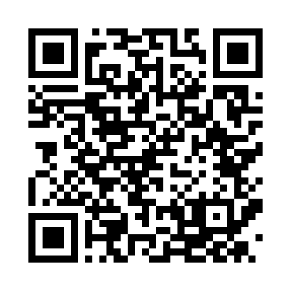

# Práctica de Seguridad en Aplicaciones Web

## Seguridad y Auditoría de Sistemas

**Laboratorio:** VaultStore Web Security Lab  
**Entorno:** Windows + WSL 2 + Kali Linux  
**Aplicaciones evaluadas:** versión vulnerable y versión segura  
**Herramientas utilizadas:** WhatWeb, Nikto, Nmap y OWASP ZAP

---

## 1. Introducción

Las aplicaciones web forman parte de la infraestructura tecnológica utilizada por organizaciones, instituciones y usuarios para acceder a sistemas, servicios y datos mediante un navegador. Debido a que estas aplicaciones pueden procesar información sensible, autenticación de usuarios y operaciones internas, es necesario evaluar sus controles de seguridad con el fin de identificar vulnerabilidades que puedan comprometer la confidencialidad, integridad o disponibilidad de la información.

En esta práctica se construyeron y evaluaron dos versiones de una aplicación web denominada **VaultStore**. La primera versión fue desarrollada deliberadamente con vulnerabilidades para fines académicos, mientras que la segunda incorpora controles de seguridad para mitigar los riesgos identificados. Ambas aplicaciones fueron analizadas en un entorno local y controlado.

!!! warning "Uso autorizado"
    Todas las pruebas descritas en este documento deben realizarse exclusivamente contra aplicaciones propias o entornos donde exista autorización expresa.

---

## 2. Objetivos

### 2.1 Objetivo general

Evaluar la seguridad de una aplicación web mediante herramientas de análisis y pruebas controladas, identificando vulnerabilidades y comparando los resultados obtenidos entre una versión vulnerable y una versión con controles de seguridad implementados.

### 2.2 Objetivos específicos

- Preparar un entorno de laboratorio utilizando Kali Linux sobre WSL.
- Identificar tecnologías y servicios utilizados por la aplicación.
- Detectar configuraciones inseguras mediante herramientas automatizadas.
- Demostrar vulnerabilidades de forma controlada.
- Implementar y comprobar controles de mitigación.
- Comparar los resultados obtenidos entre ambas versiones.

---

## 3. Arquitectura del laboratorio

| Aplicación | Puerto | Descripción |
|---|---:|---|
| VaultStore Vulnerable | 5000 | Aplicación deliberadamente insegura |
| VaultStore Secure | 5001 | Aplicación con controles de seguridad |

```text
Windows
│
├── Navegador web
├── OWASP ZAP
│
└── WSL 2
    └── Kali Linux
        ├── Python / Flask
        ├── WhatWeb
        ├── Nikto
        ├── Nmap
        ├── VaultStore Vulnerable :5000
        └── VaultStore Secure     :5001
```

La versión vulnerable permite comprobar fallas de seguridad de manera controlada, mientras que la versión segura permite repetir las mismas pruebas y verificar las mitigaciones implementadas.

## Código QR del sitio

<div align="center">

Escanea el siguiente código para abrir la documentación:



</div>
